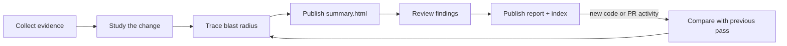

# review-change

Understand a change before judging it. `review-change` studies local or pull-request changes in plain English, maps their blast radius, then delivers findings in a separate review pass.

## What it produces

The review arrives in two phases:

1. **Context** — `summary.html` explains the change and its blast radius while findings review continues.
2. **Judgment** — a numbered `NN.report.html` records the verdict, findings, tests, and optional submission handoff.

`index.html` links the durable summary and every review pass with one consistent visual style.

At the end of a review, the skill presents `index.html` first as a clickable local link and repeats its absolute path in a plain-text block for quick copying. The latest findings report, durable summary, verdict, and coverage limits follow in the same compact handoff. An unchanged follow-up returns those existing artifact paths again instead of leaving the user to find the session directory.

```text
review-change/
├── summary.html       Study + blast-radius history
├── index.html         Review-series navigation
├── 01.report.html     First findings pass
├── 02.report.html     Incremental findings pass
└── ...
```

The study is written once. Later passes preserve it, summarize only what changed since the previous pass, and trace that delta's blast radius. If a rewrite invalidates the original mental model, the study receives an explicit revision.

## Workflow



The summary separates:

- **Claimed intent** — description or discussion from the PR.
- **Observed behavior** — evidence confirmed in code and tests.
- **Blast radius** — surfaces that may be affected.
- **Review targets** — behavior worth investigating further.
- **Unknowns** — questions repository evidence cannot answer.

Only confirmed problems become findings.

## Supported scenarios

| Scenario | Behavior |
|---|---|
| Open pull request with a clean worktree | Reviews the PR's latest commit, fetching it when missing and safely fast-forwarding a behind checked-out branch. |
| Local commits without a PR | Builds the same summary and review from the local diff and repository evidence. |
| Staged, unstaged, or untracked changes | Includes them in the worktree snapshot; a PR review containing local-only changes cannot be submitted. |
| First review | Creates a full study, full blast-radius map, and findings pass. |
| Later code change | Reviews the diff from the previous pass and appends a blast-radius delta. |
| New external PR comment or review | Opens an activity-only pass, even when code is unchanged. |
| Activity by the authenticated GitHub user | Remains visible but does not open a new pass by itself. |
| No code or relevant PR activity changed | Returns `unchanged` without creating another pass. |
| Base branch changed | Archives the old series and starts a new full review. |
| Local history was rebased or rewritten | Archives the old series and starts a new full review. |
| Branch changed | Uses a separate branch-scoped review session. |
| Review pass is unfinished | Refuses to collect another pass until the current one is complete. |
| Local-only review | Produces summary and findings; GitHub submission is unavailable. |
| Latest open-PR review of a committed tree | Generates a submission command for the user to inspect and run. |
| Historical review | Remains readable but cannot generate a submission. |
| PR closed after review | Rejects submission because the PR can no longer receive a review. |
| PR HEAD changed after review | Warns and pauses for confirmation, then submits against GitHub's latest PR commit without pinning a commit ID. |

## Local and remote branch states

When a remote-tracking base such as `origin/main` exists, the review uses its merge-base with the resolved review head: the latest PR commit for a clean PR worktree, otherwise local `HEAD`.

| Branch state | Review scope |
|---|---|
| Clean PR branch behind the PR head | Fetches the exact PR head if needed, safely fast-forwards the branch, and reviews the PR head. |
| Clean PR branch ahead of or diverged from the PR head | Leaves the branch unchanged and reviews the PR head directly. |
| Dirty PR worktree | Reviews the local tree; submission stays unavailable because that tree is not on the PR. |
| No open PR | Reviews local commits and worktree changes against the resolved base. |
| No remote-tracking base | Falls back to an available local base. |
| Detached HEAD | Supported under a detached-HEAD session identity. |

Remote-tracking base refs reflect the repository state already available locally. The skill fetches only the exact PR head object when that commit is missing. If local `HEAD` is an ancestor of the PR head and the worktree is clean, it fast-forwards the checked-out branch. It does not refresh base refs or rewrite a dirty or diverged branch.

## Blast-radius coverage

Every pass checks six impact rings:

| Ring | Question |
|---|---|
| Direct | Who calls the changed code, and what does it call? |
| Glue | Did adapters, middleware, registration, mapping, or dependency wiring change symmetrically? |
| Contract | Did an API, schema, event, configuration, or compatibility promise change? |
| Parallel | Was one implementation changed while a sibling path was missed? |
| Integration | What external service, background job, cache, webhook, or deployment order depends on it? |
| Operational | Can the change be observed, deployed, rolled back, and migrated safely? |

Each ring is recorded as `checked`, `not_applicable`, or `not_verified`. An unverified surface is a coverage gap, not automatically a finding.

## Safety boundaries

`review-change` does not:

- discard staged, unstaged, or untracked work;
- refresh base refs, create merge commits, rebase, or rewrite dirty or diverged branches;
- post findings to GitHub automatically;
- submit from a historical review;
- submit a verdict based on local worktree changes that are absent from the PR;
- treat PR description or discussion as authoritative behavior.

The final report generates a terminal command for every latest completed PR pass whose reviewed tree is committed, regardless of the local checkout or later PR movement. Historical, local-only, and dirty-worktree reviews do not generate one. If the PR moves afterward, submission warns and asks for confirmation before proceeding against the latest commit. A non-interactive caller must deliberately add `--accept-moved-head`; cancellation exits with status 2. Posting always requires the user's deliberate action.

## Requirements

- Git repository
- Node.js 18 or newer
- Authenticated `gh` for PR discovery and submission commands

Invoke the skill with:

```text
/review-change
```
