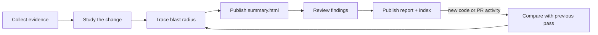

# review-change

Understand a change before judging it. `review-change` studies local or pull-request changes in plain English, maps their blast radius, then delivers findings in a separate review pass.

## What it produces

The review arrives in two phases:

1. **Context** — `summary.html` explains the change and its blast radius while findings review continues.
2. **Judgment** — a numbered `NN.report.html` records the verdict, findings, tests, and optional submission handoff.

`index.html` links the durable summary and every review pass with one consistent visual style.

```text
review-change/
├── summary.html       Study + blast-radius history
├── index.html         Review-series navigation
├── 01.report.html     First findings pass
├── 02.report.html     Incremental findings pass
└── ...
```

The study is written once. Later passes preserve it, summarize only what changed since the previous pass, and trace that delta's blast radius. If a rewrite invalidates the original mental model, the study receives an explicit revision.

## Workflow



The summary separates:

- **Claimed intent** — description or discussion from the PR.
- **Observed behavior** — evidence confirmed in code and tests.
- **Blast radius** — surfaces that may be affected.
- **Review targets** — behavior worth investigating further.
- **Unknowns** — questions repository evidence cannot answer.

Only confirmed problems become findings.

## Supported scenarios

| Scenario | Behavior |
|---|---|
| Open pull request | Uses the PR description, discussion, diff, and repository evidence. |
| Local commits without a PR | Builds the same summary and review from the local diff and repository evidence. |
| Staged or unstaged changes | Includes them in the worktree snapshot. |
| First review | Creates a full study, full blast-radius map, and findings pass. |
| Later code change | Reviews the diff from the previous pass and appends a blast-radius delta. |
| New external PR comment or review | Opens an activity-only pass, even when code is unchanged. |
| Activity by the authenticated GitHub user | Remains visible but does not open a new pass by itself. |
| No code or relevant PR activity changed | Returns `unchanged` without creating another pass. |
| Base branch changed | Archives the old series and starts a new full review. |
| Local history was rebased or rewritten | Archives the old series and starts a new full review. |
| Branch changed | Uses a separate branch-scoped review session. |
| Review pass is unfinished | Refuses to collect another pass until the current one is complete. |
| Local-only review | Produces summary and findings; GitHub submission is unavailable. |
| Latest open-PR review | Generates a submission command for the user to inspect and run. |
| Historical review | Remains readable but cannot generate a submission. |
| PR closed or HEAD changed after review | Rejects submission as stale. |

## Local and remote branch states

When a remote-tracking base such as `origin/main` exists, the review uses its merge-base with local `HEAD`.

| Branch state | Review scope |
|---|---|
| Local ahead | Local commits and worktree changes. |
| Local behind and clean | Nothing to review. |
| Local and remote diverged | Local-only commits and worktree changes; remote-only commits are excluded. |
| No remote-tracking base | Falls back to an available local base; on the base branch this may leave only worktree changes. |
| Detached HEAD | Supported under a detached-HEAD session identity. |

The skill does not run `git fetch`. Remote-tracking refs reflect the repository state already available locally, and divergence is not currently surfaced as an explicit warning.

## Blast-radius coverage

Every pass checks six impact rings:

| Ring | Question |
|---|---|
| Direct | Who calls the changed code, and what does it call? |
| Glue | Did adapters, middleware, registration, mapping, or dependency wiring change symmetrically? |
| Contract | Did an API, schema, event, configuration, or compatibility promise change? |
| Parallel | Was one implementation changed while a sibling path was missed? |
| Integration | What external service, background job, cache, webhook, or deployment order depends on it? |
| Operational | Can the change be observed, deployed, rolled back, and migrated safely? |

Each ring is recorded as `checked`, `not_applicable`, or `not_verified`. An unverified surface is a coverage gap, not automatically a finding.

## Safety boundaries

`review-change` does not:

- modify the reviewed working tree;
- fetch, merge, rebase, or resolve divergence;
- post findings to GitHub automatically;
- submit from a historical or stale review;
- treat PR description or discussion as authoritative behavior.

The final report generates a terminal command only for the latest completed PR pass. Posting requires the user's deliberate copy-and-paste action.

## Requirements

- Git repository
- Node.js 18 or newer
- Authenticated `gh` for PR discovery and submission commands

Invoke the skill with:

```text
/review-change
```
