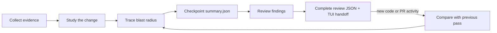

# review-change

Understand a change before judging it. `review-change` studies local or pull-request changes in plain English, maps their blast radius, then delivers findings in a separate review pass.

## What it produces

The review is stored as structured JSON and delivered in two phases:

1. **Context** — `summary.json` explains the change and its blast radius while findings review continues.
2. **Judgment** — `NN.review.json` records the verdict, message, findings, tests, and coverage.

The final command prints a concise agent-TUI handoff from a checked-in template. It includes the verdict, exact submit message, coverage, parameterized skill invocation, and blocking findings for a rejection. The model writes the judgment once; the script owns repeated presentation copy.

The skill invocation is the user interface. Its bundled executable is an internal adapter, so users do not need terminal access or a `review-change` executable on `PATH`.

HTML is optional. `/review-change render` generates or refreshes it, and `/review-change open` renders it before opening `index.html` in the system browser.

```text
review-change/
├── summary.json       Canonical study + blast-radius history
├── 01.review.json     Canonical first judgment pass
├── summary.html       Study + blast-radius history
├── index.html         Review-series navigation
├── 01.report.html     First findings pass
├── 02.report.html     Incremental findings pass
└── ...
```

The study is written once. Later passes preserve it, summarize only what changed since the previous pass, and trace that delta's blast radius. If a rewrite invalidates the original mental model, the study receives an explicit revision.

## Workflow



The summary separates:

- **Claimed intent** — description or discussion from the PR.
- **Observed behavior** — evidence confirmed in code and tests.
- **Blast radius** — surfaces that may be affected.
- **Review targets** — behavior worth investigating further.
- **Unknowns** — questions repository evidence cannot answer.

Only confirmed problems become findings.

## Supported scenarios

| Scenario | Behavior |
|---|---|
| Every collection | Fetches `origin` and rediscovers the current branch's open-PR status before comparing changes. |
| Open pull request with a clean worktree | Verifies the checkout matches the freshly discovered PR head, safely fast-forwarding a behind branch first. |
| Local commits without a PR | Builds the same summary and review from the local diff and repository evidence. |
| Staged, unstaged, or untracked changes with a PR or remote branch | Stops before review and preserves the worktree for the user to resolve. |
| First review | Creates a full study, full blast-radius map, and findings pass. |
| Later code change | Reviews the diff from the previous pass and appends a blast-radius delta. |
| New external PR comment or review | Opens an activity-only pass, even when code is unchanged. |
| Activity by the authenticated GitHub user | Remains visible but does not open a new pass by itself. |
| No code or relevant PR activity changed | Returns `unchanged` without creating another pass. |
| Base branch changed | Archives the old series and starts a new full review. |
| Local history was rebased or rewritten | Archives the old series and starts a new full review. |
| Branch changed | Uses a separate branch-scoped review session. |
| Review pass is unfinished | Refuses to collect another pass until the current one is complete. |
| Local-only review | Produces summary and findings; GitHub submission is unavailable. |
| Latest open-PR review of a committed tree | Generates `/review-change submit C1,C2` for the user to inspect and invoke. |
| Historical review | Remains readable but cannot generate a submission. |
| PR closed after review | Rejects submission because the PR can no longer receive a review. |
| PR HEAD changed after review | Stops with a warning and requires a new `accept-moved-head` invocation before submitting against GitHub's latest PR commit. |

## Local and remote branch states

When a remote-tracking base such as `origin/main` exists, the review uses its merge-base with the synchronized review head.

| Branch state | Review scope |
|---|---|
| Clean branch already at the PR or remote head | Verifies the commit and worktree tree exactly, then reviews it. |
| Clean branch behind the PR or remote head | Safely fast-forwards, verifies the exact checkout, then reviews it. |
| Clean branch ahead of or diverged from the PR or remote head | Stops with the two commits and relationship; the branch is unchanged. |
| Dirty worktree with a PR or remote branch | Stops and reports the local changes; the worktree is unchanged. |
| No PR or remote branch counterpart | Performs a local-only review against an available base. |
| Detached HEAD | Supported under a detached-HEAD session identity. |

Every collection fetches and prunes `origin`, so remote-tracking branches and base refs are current. It also rediscovers open-PR status from the checked-out branch instead of trusting the previous pass. A discovered PR head takes precedence over the tracking branch. Collection then enforces exact-or-exit: local `HEAD` and the full worktree tree must match the fetched target before review begins. It never resets, rebases, merges divergent history, or discards work to achieve that match.

## Blast-radius coverage

Every pass checks six impact rings:

| Ring | Question |
|---|---|
| Direct | Who calls the changed code, and what does it call? |
| Glue | Did adapters, middleware, registration, mapping, or dependency wiring change symmetrically? |
| Contract | Did an API, schema, event, configuration, or compatibility promise change? |
| Parallel | Was one implementation changed while a sibling path was missed? |
| Integration | What external service, background job, cache, webhook, or deployment order depends on it? |
| Operational | Can the change be observed, deployed, rolled back, and migrated safely? |

Each ring is recorded as `checked`, `not_applicable`, or `not_verified`. An unverified surface is a coverage gap, not automatically a finding.

## Safety boundaries

`review-change` does not:

- discard staged, unstaged, or untracked work;
- create merge commits, rebase, or rewrite dirty, ahead, or diverged branches;
- post findings to GitHub automatically;
- submit from a historical review;
- review or submit a PR while its checkout differs from the fetched PR head;
- treat PR description or discussion as authoritative behavior.

The final TUI handoff and optional HTML report generate a parameterized skill invocation for every latest completed PR pass whose reviewed tree is committed, regardless of the local checkout or later PR movement. Finding IDs use one comma-separated argument. Historical, local-only, and dirty-worktree reviews do not generate one. If the PR moves afterward, submission stops and requires a new invocation with `accept-moved-head`. Posting always requires the user's deliberate `submit` invocation.

## Chat interface

```text
/review-change                     Review the current change
/review-change open                Render and open optional HTML
/review-change render              Generate or refresh optional HTML
/review-change submit              Submit the verdict and top-level message
/review-change submit C1,C2        Also submit selected inline findings
/review-change submit C1,C2 accept-moved-head
```

Where slash parameters are unavailable, select or invoke `review-change` and pass an equivalent explicit argument such as “submit C1 and C2.” The bundled CLI remains available to the skill as an implementation detail.

## Requirements

- Git repository
- Node.js 18 or newer
- Authenticated `gh` for PR discovery and submission commands

Invoke the skill with:

```text
/review-change
```
